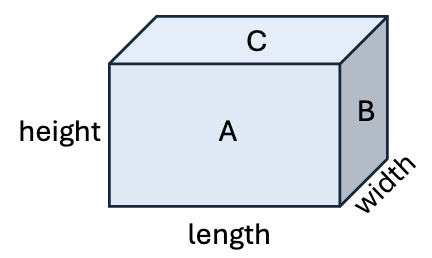

You will implement methods in the `PaintCalculator` class to compute the cost of painting
a rectangular room. The dimensions are given as length, width, and height.

Type `^Ctrl` `R` to run the program and enter a sample room length and width.
Notice the program does not output the correct value for the ceiling area.

The `ceilingArea` method should return the area of the ceiling (face C), but
the code just returns 0.0.

| Method Call             | Expected Result | Actual Result|
|-------------------------|-----------------|----|
| ceilingArea(15.0, 12.0) | 180.0           |0.0|
| ceilingArea(7.5, 11.5)  | 86.25           |0.0|

Fix the `ceilingArea` method to calculate the area using the length and width parameters. 

Run the program to confirm the expected result is produced.

Check your solution to proceed to the next task.