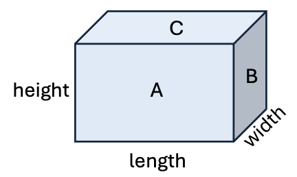

There are four walls that need to be painted in the room. 
- The front wall (face A) and back wall (not shown) each have an area of `length x height`.
- The right wall (face B) and left wall (not shown) each have an area of `width x height`.



Add a new method named `wallArea` to compute the total area of the four walls.

```java
/**
 * wallArea - Returns the wall area given the room length, width, and height.
 * @param length - the room length as a double.
 * @param width - the room width as a double.
 * @param height - the room height as a double.
 * @return the wall area as a double.
 */
 ```

| Method Call          | Expected Result |
|----------------------|-----------------|
| wallArea(15.0, 12.0, 10.0)| 540.0  |
| wallArea(7.5, 11.5, 8.25) | 313.5 |

Update the `main` method to read in the room length, width, and height.
The program should calculate and print the ceiling and wall areas.
Format the output as shown in the sample below.

```text
Enter room length, width and height.
15.0 12.0 10.0 
Ceiling area = 180.0
Wall area = 540.0
```

Run the program to confirm the expected result is produced.

Check your solution to proceed to the next task.
